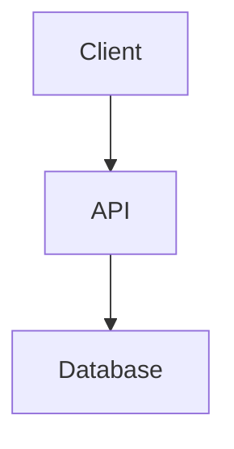

# Example Usage

This directory demonstrates how to use the `xeost/xeo-system-docs` Docker image to host your system documentation.

## Purpose

This image serves as a **Source of Truth** for your system design and API specifications. In an AI-assisted development workflow, it provides a centralized, machine-readable, and human-friendly documentation hub. It bundles:

- **Starlight** for beautiful, searchable Markdown documentation.
- **Mermaid** for diagramming support.
- **Swagger UI & Redoc** for API visualization.
- **Raw Spec Server** for tool consumption.

## Getting Started

To use this setup in your own project, follow these steps:

### 1. Directory Structure

Create the following structure in your project:

```
.
├── docs/                 # Your Markdown content
│   └── system-design/    # Example subdirectory
│       └── 01-overview.md
├── openapi/              # Your OpenAPI specifications
│   └── api-spec.yml
├── starlight.config.mjs  # Configuration for the docs site
└── docker-compose.yml
```

### 2. Docker Compose Configuration

Create a `docker-compose.yml` file using the public image from Docker Hub:

```yaml
services:
  docs:
    image: xeost/xeo-system-docs:latest
    ports:
      - "12000:4321" # Documentation Site
      - "12001:8081" # Raw Spec Server
      - "12002:8082" # Swagger UI
      - "12003:8083" # Redoc
    environment:
      # IMPORTANT: This must match the external port mapped to 8081 (Raw Spec Server)
      - SPEC_EXTERNAL_PORT=12001
    volumes:
      # Mount your content
      - ./docs:/app/starlight/src/content/docs
      # Mount your API specs
      - ./openapi:/app/api-design
      # Mount your configuration
      - ./starlight.config.mjs:/app/starlight/starlight.config.mjs
```

### 3. Customization

#### Documentation Content (`docs/`)
Place your Markdown files in the `docs/` directory. Starlight supports standard Markdown and MDX. You can organize files into subdirectories to create sidebar sections.

Example `docs/system-design/01-overview.md`:
````markdown
---
title: Overview
description: System architecture overview
---

## Architecture Diagram


````

#### OpenAPI Specification (`openapi/`)
Place your `api-spec.yml` (or `.json`) in the `openapi/` directory. This file will be served by the Raw Spec Server and visualized by Swagger UI and Redoc.

#### Starlight Configuration (`starlight.config.mjs`)
Use this file to customize the look and feel of your documentation site, including the sidebar, title, and social links.

Example `starlight.config.mjs`:
```javascript
export default {
    title: 'My Project Docs',
    social: [{ icon: 'github', label: 'GitHub', href: 'https://github.com/my-org/my-repo' }],
    sidebar: [
        {
            label: 'System Design',
            items: [
                // Auto-generate links from the file system, or specify manually
                { label: 'Overview', slug: 'system-design/01-overview' },
            ],
        },
    ],
}
```

### 4. Running the Docs

Run the following command to start the services:

```bash
docker compose up --build -d
```

Access your services at:
- **Docs**: http://localhost:12000
- **Raw Spec**: http://localhost:12001/api-spec.yml
- **Swagger UI**: http://localhost:12002
- **Redoc**: http://localhost:12003


### 5. Stopping the Docs

Run the following command to stop the services:

```bash
docker compose down --volumes --rmi local
```